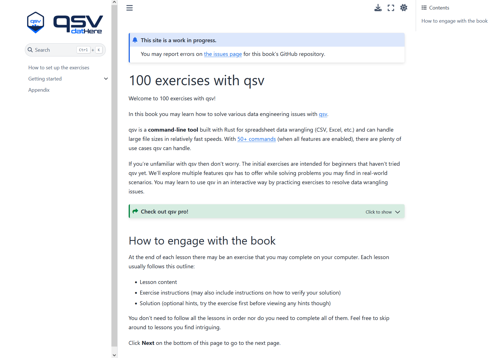
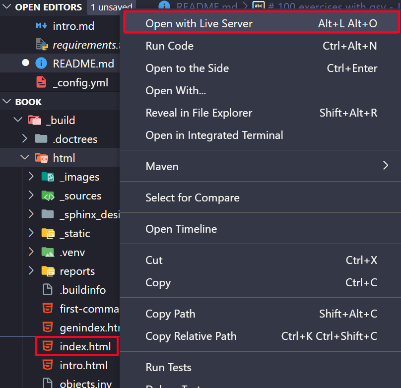

# 100.dathere.com

**Try out available exercises:** [100.dathere.com](https://100.dathere.com)

This codebase includes source code for "100 exercises with qsv" found at [100.dathere.com](https://100.dathere.com).



## How to run the Jupyter Book locally

Ensure you are using one of the following OS/software:

- Windows Subsystem for Linux 2 (not Windows) running Ubuntu
- macOS
- Linux

0. Install the prerequisites:

-   [Git](https://git-scm.com/)
-   [Visual Studio Code](https://code.visualstudio.com/) - Code editor
    -   [Live Server extension](https://marketplace.visualstudio.com/items?itemName=ritwickdey.LiveServer) - Local server extension (to view Jupyter Book locally and hot reload)
    -   [Run on Save extension](https://marketplace.visualstudio.com/items?itemName=emeraldwalk.RunOnSave) - Allows for auto-build on save for the file types specified in [../.vscode/settings.json](../.vscode/settings.json)
-   [Python](https://python.org/)
-   [uv](https://github.com/astral-sh/uv) - Python package manager

1. Clone the repository to your local device using [Git](https://git-scm.com/):

```bash
git clone https://github.com/dathere/100.dathere.com.git
```

3. Change your directory into this folder `book`.
4. Run `uv venv`, this should generate a `.venv` folder.
5.

-   On macOS and Linux
    -   Run `source .venv/bin/activate`
-   On Windows
    -   Run `.venv\Scripts\activate`

6. Run `uv pip install -r requirements-local.txt`.
7. Run `uv pip install -e ./bash_kernel` and then `python -m bash_kernel.install` to install the Bash kernel.
8. Run `jb build .` to build the book or save a `.md`, `.ipynb`, or `.yml` file in VS Code for the Run on Save extension to run relevant commands.
9. Right click on `_build/html/index.html` and click Open with Live Server which should launch a local build of the website and should reload within a few seconds each time you save a `.md` or `.yml` file in VS Code (you may need to refresh the page once Run on Save is done each time).



## Notice

datHere and the maintainers of this repository are the current organizers of the book's content, and therefore may or may not merge pull requests and/or resolve issues/discussions at their discretion. If you need further assistance, please reach out at [dathere.com/contact](https://dathere.com/contact).

---

© Copyright [datHere](https://dathere.com)


