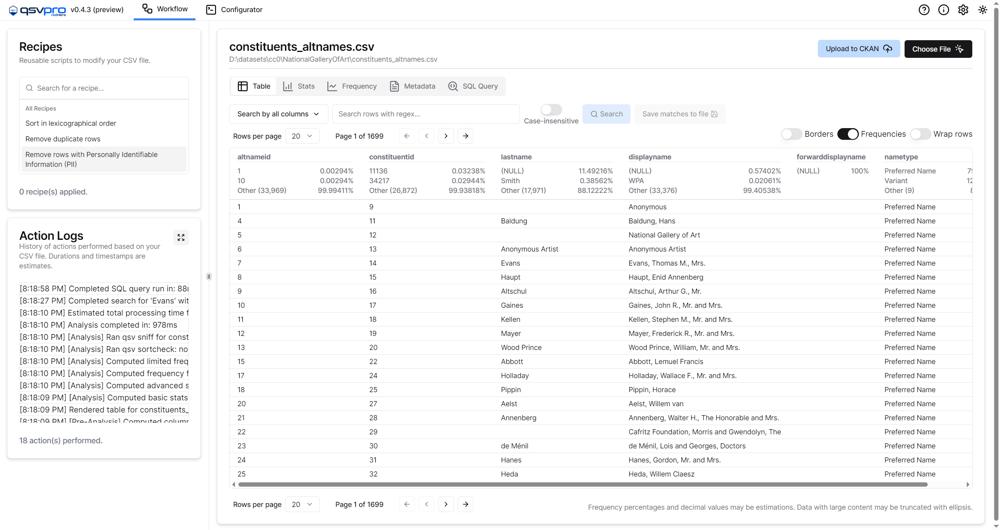

```{admonition} This site is a work in progress.
:tags: important
You may report errors on [the issues page](https://github.com/dathere/100.dathere.com/issues) for this book's GitHub repository.
```

# 100 exercises with qsv

Welcome to 100 exercises with qsv!

In this book you may learn how to solve various data engineering issues with [qsv](https://github.com/jqnatividad/qsv).

qsv is a **command-line tool** built with Rust for spreadsheet data wrangling (CSV, Excel, etc.) and can handle large file sizes in relatively fast speeds. With [50+ commands](https://github.com/jqnatividad/qsv?tab=readme-ov-file#available-commands) (when all features are enabled), there are plenty of use cases qsv can handle.

If you're unfamiliar with qsv then don't worry. The initial exercises are intended for beginners that haven't tried qsv yet. We'll explore multiple features qsv has to offer while solving problems you may find in real-world scenarios. You may learn to use qsv in an interactive way by practicing exercises to resolve data wrangling issues.

```{admonition} Check out qsv pro!
:class: dropdown seealso

qsv pro (preview) is a **cross-platform desktop app** for spreadsheet data wrangling and it uses qsv for many of its core features. Check out [qsvpro.dathere.com](https://qsvpro.dathere.com) to download and try it out!



```

## How to engage with the book

Each lesson usually follows this outline:

-   Lesson content
-   Exercise instructions
-   Solution

You don't need to follow all the lessons in order nor do you need to complete all of them. Feel free to skip around to lessons you find intriguing.

Click **Next** on the bottom of this page to go to the next page.
