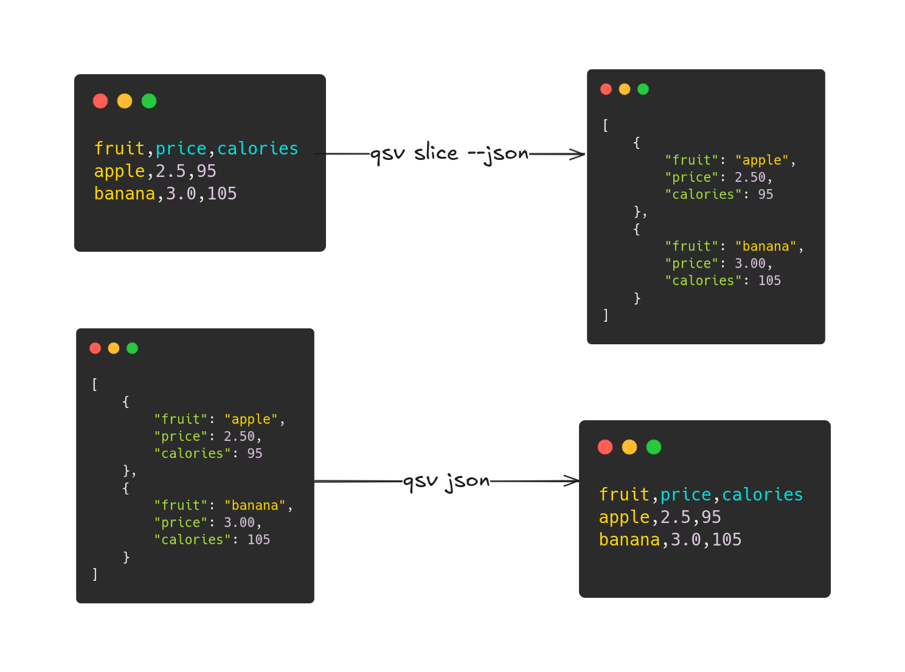
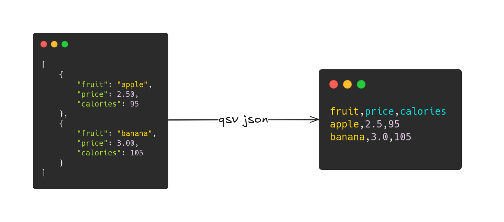
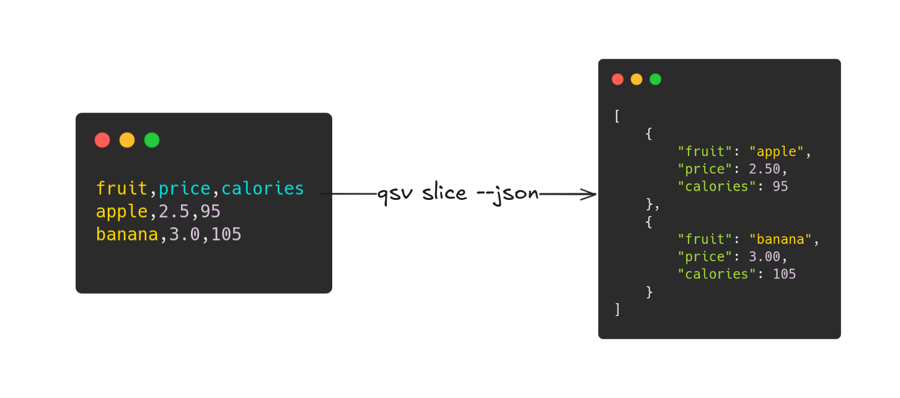

---
jupytext:
    text_representation:
        extension: .md
        format_name: myst
kernelspec:
    display_name: Bash
    language: bash
    name: bash
---

# Lesson 3: qsv and JSON



A common file format that's often used for sharing data is JSON. qsv includes various capabilities to interact between CSV data and JSON data, so we'll cover two common use cases in this lesson.

## JSON to CSV



The [`qsv json`](https://github.com/dathere/qsv/blob/master/src/cmd/json.rs) command can help with generating CSV data from JSON data. The help message includes criteria necessary for generating JSON data from CSV data, along with multiple useful flags including:

- `--jaq` for filtering JSON data using [jq](https://jqlang.github.io/jq/)-like syntax (based on [jaq](https://github.com/01mf02/jaq)), where jq is a common JSON command-line tool
- `--select` for selecting, reordering, or dropping columns for output

```{code-cell}
:tags: ["scroll-output"]
qsv json -h
```

## CSV to JSON



The [`qsv slice`](https://github.com/dathere/qsv/blob/master/src/cmd/slice.rs) command has a `--json` flag that can help generate JSON data from CSV data.

```{code-cell}
:tags: ["scroll-output"]
qsv slice -h
```

## Exercise 3: qsv and JSON

[](https://mybinder.org/v2/gh/dathere/100.dathere.com/main?labpath=lessons%2F3%2Fexercise.ipynb)

Using `qsv json`, `qsv slice`, and their options, complete each of the following tasks on the `flowers.json`, `flowers_nested.json`, and `buses.csv` files:

1. Generate CSV data from `flowers.json` and pipe the output into `qsv table`.
2. We have nested data in `flowers_nested.json`. Generate CSV data from the file with only roses data and pipe the output into `qsv table`.
3. Generate JSON data from `buses.csv`.

> Here we show the usage text of `qsv json` for your reference. Solve this exercise using [Thebe](exercises-setup:thebe), [Binder](exercises-setup:binder) or [locally](exercises-setup:local).

```{code-cell}
:tags: ["scroll-output"]
qsv json --help
```

::::{admonition} Solution for task 1
:class: dropdown seealso

You may first want to identify the structure of `flowers.json` and whether it adheres to the criteria necessary for `qsv json` to work as intended by default.

Here's the criteria for your reference:

The JSON data is expected to be non-empty and non-nested as either:

1. An array of objects where:
  - A. All objects are non-empty, have non-empty and unique keys, and the same keys are in each object.
  - B. Values are not objects or arrays.
2. An object where values are not objects or arrays and the object is as described above.

The data in `flowers.json` is non-empty, non-nested, and fits the criteria for an array of objects in point 1, therefore we do not need to run a filter using `--jaq` to generate CSV data from it when using `qsv json`.

The following command should generate the expected output:

```bash
qsv json flowers.json | qsv table
```

The output should be:

```
name       primary_color  available  quantity
tulip      purple         true       4
rose       red            true       6
sunflower  yellow         false      0
```

::::

::::{admonition} Solution for task 2
:class: dropdown seealso

The `flowers_nested.json` file includes nested data and the task only requires data about roses. Observing the `flowers_nested.json` file's data, we see that it is an array of flowers where there are two keys that have their own array of objects. However, the criteria for running `qsv json` the data to not be nested.

The two keys are `tulips` and `roses`. Since we only want roses data, we need to specify the roses data for our output. We can use the `--jaq` option to filter the JSON data for only roses data by specifying the `.roses` filter which runs a filter on the JSON data to only process the value of the `roses` key for generating CSV data.

The following command should generate the expected output:

```bash
qsv json flowers_nested.json --jaq .roses | qsv table
```

The output should be:

```
color  quantity
red    4
white  1
pink   1
```

::::

::::{admonition} Solution for task 3
:class: dropdown seealso

We can use `qsv slice` with its `--json` flag to generate JSON data from the given CSV.

The following command should generate the expected output:

```bash
qsv slice buses.csv --json
```

The output should be:

```json
[{"id":"001","primary_color":"black","secondary_color":"blue","length":"full","air_conditioner":"true","amenities":"wheelchair ramp, tissue boxes, cup holders, USB ports"},{"id":"002","primary_color":"black","secondary_color":"red","length":"full","air_conditioner":"true","amenities":"wheelchair ramp, tissue boxes, USB ports"},{"id":"003","primary_color":"white","secondary_color":"blue","length":"half","air_conditioner":"true","amenities":"wheelchair ramp, tissue boxes"},{"id":"004","primary_color":"orange","secondary_color":"blue","length":"full","air_conditioner":"false","amenities":"wheelchair ramp, tissue boxes, USB ports"},{"id":"005","primary_color":"black","secondary_color":"blue","length":"full","air_conditioner":"true","amenities":"wheelchair ramp, tissue boxes, cup holders, USB ports"}]
```

If you have jaq installed then you could pipe this output into `jaq .` to view the data in a prettier format.

::::
