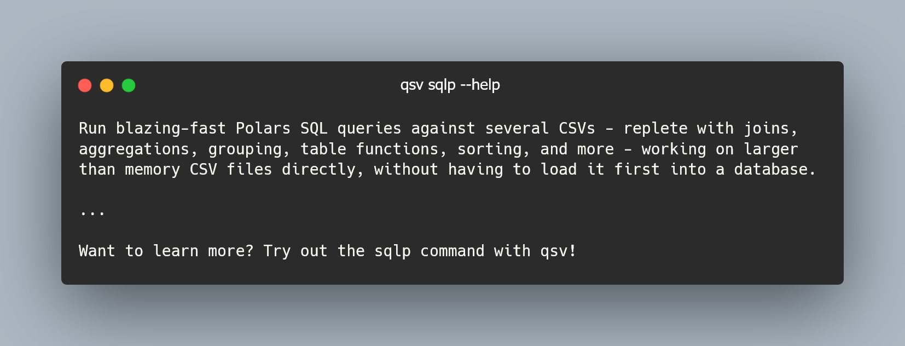

---
jupytext:
    text_representation:
        extension: .md
        format_name: myst
kernelspec:
    display_name: Bash
    language: bash
    name: bash
---

# Lesson 4: Running Polars SQL queries with qsv



The [Polars](https://pola.rs) library is used by qsv to enhance data engineering capabilities. One of the multiple benefits that Polars provides for qsv is the ability to run Polars SQL queries with qsv's `sqlp` command.

```{code-cell}
:tags: ["scroll-output"]
qsv sqlp -h
```

There are plenty of example queries you can copy for your usage in the help message of `qsv sqlp` above.

Note that when you run a query, you may get the shape of the output data from standard error (`stderr`) after the output. For example you may see `(5, 6)` after the output representing 5 rows and 6 columns. 

We'll hide the shape from the output by adding the `-q` or `--quiet` flag in the exercises.

## Exercise 4: Running Polars SQL queries with qsv

[](https://mybinder.org/v2/gh/dathere/100.dathere.com/main?labpath=lessons%2F4%2Fexercise.ipynb)

Use `qsv sqlp` and its options to complete each of the following tasks on the `buses.csv` file (assume the headers are included in the output, otherwise you may usually pipe the output into `qsv behead` if needed):

1. Display all of the data.
2. Display the first 2 rows of data.
3. Display all the bus IDs with their lengths and whether they have air conditioning. Then render this output with `qsv table`.
4. Display all bus IDs which have air conditioning. Output the data in JSON format.
5. Display all bus IDs which have cup holders. Output the data in JSONL format.
6. Get the count of all buses where the primary color is either black or white.

> Here we show the usage text of `qsv sqlp` for your reference. Solve this exercise using [Thebe](exercises-setup:thebe), [Binder](exercises-setup:binder) or [locally](exercises-setup:local).

```{code-cell}
:tags: ["scroll-output"]
qsv sqlp --help
```

::::{admonition} Solution for task 1
:class: dropdown seealso

```bash
qsv sqlp buses.csv 'SELECT * FROM buses' -q
```

You can also replace `buses` with `_t_1` as per the help message.

The output should be:

```csv
id,primary_color,secondary_color,length,air_conditioner,amenities
1,black,blue,full,true,"wheelchair ramp, tissue boxes, cup holders, USB ports"
2,black,red,full,true,"wheelchair ramp, tissue boxes, USB ports"
3,white,blue,half,true,"wheelchair ramp, tissue boxes"
4,orange,blue,full,false,"wheelchair ramp, tissue boxes, USB ports"
5,black,blue,full,true,"wheelchair ramp, tissue boxes, cup holders, USB ports"
```

::::

::::{admonition} Solution for task 2
:class: dropdown seealso

```bash
qsv sqlp buses.csv 'SELECT * FROM buses LIMIT 2' -q
```

```csv
id,primary_color,secondary_color,length,air_conditioner,amenities
1,black,blue,full,true,"wheelchair ramp, tissue boxes, cup holders, USB ports"
2,black,red,full,true,"wheelchair ramp, tissue boxes, USB ports"
```

::::

::::{admonition} Solution for task 3
:class: dropdown seealso

```bash
qsv sqlp buses.csv 'SELECT id,length,air_conditioner FROM buses' -q | qsv table
```

```
id  length  air_conditioner
1   full    true
2   full    true
3   half    true
4   full    false
5   full    true
```

::::

::::{admonition} Solution for task 4
:class: dropdown seealso

```bash
qsv sqlp buses.csv "SELECT id FROM buses WHERE air_conditioner = 'true'" --format json -q
```

```json
[{"id":1},{"id":2},{"id":3},{"id":5}]
```

::::

::::{admonition} Solution for task 5
:class: dropdown seealso

```bash
qsv sqlp buses.csv "SELECT id FROM buses WHERE amenities ILIKE '%cup holders%'" --format jsonl -q
```

```json
{"id":1}
{"id":5}
```

::::

::::{admonition} Solution for task 6
:class: dropdown seealso

```bash
qsv sqlp buses.csv "SELECT COUNT(*) FROM buses WHERE primary_color = 'black' OR primary_color = 'white'" -q
```

```csv
len
4
```

Notice the output is a table with a single column named `len` and a single record with the count of `4`. How can we get just the count `4` as the output?

One way is to pipe the command into `qsv behead`. Another way may be to not get the count within the SQL query but rather pipe the output into `qsv count`. There are often many ways to solve the same problem with qsv!

::::
